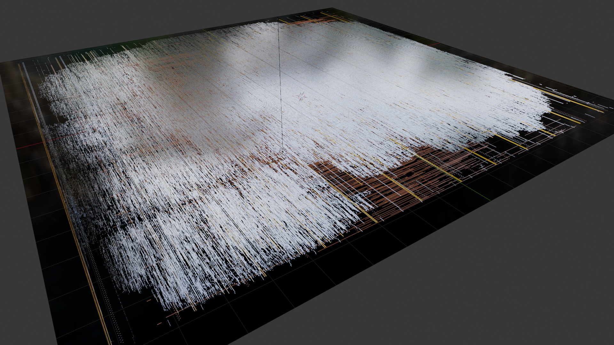
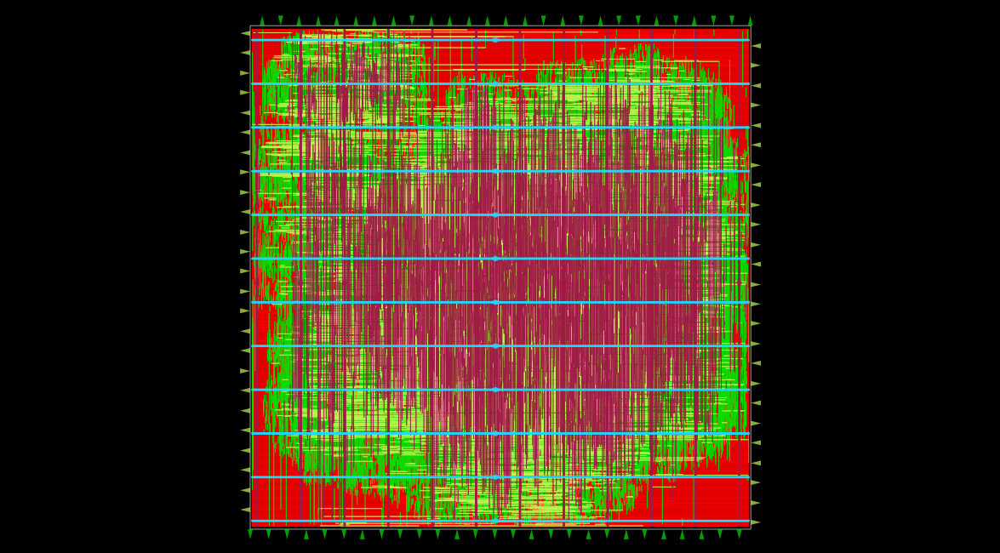
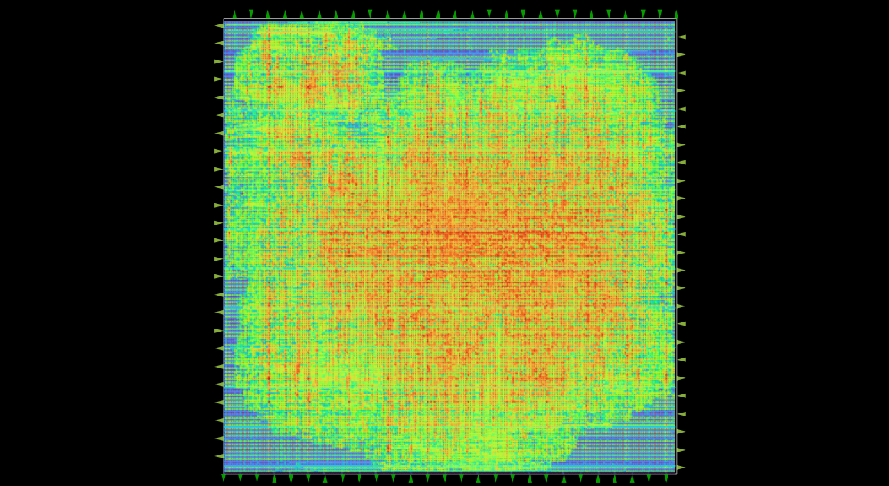
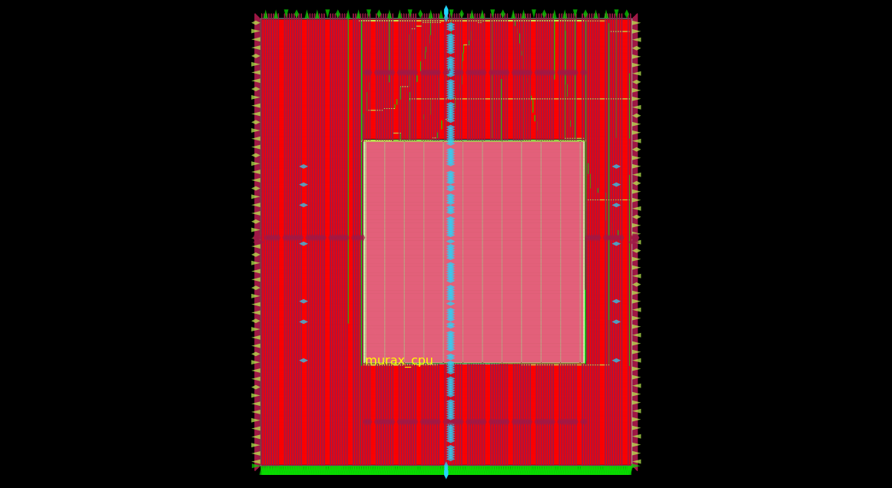
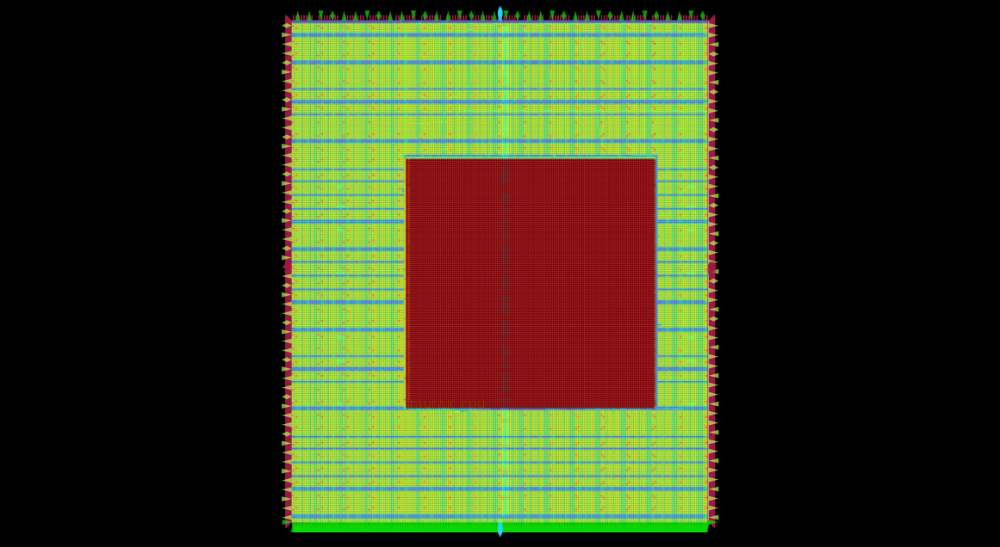
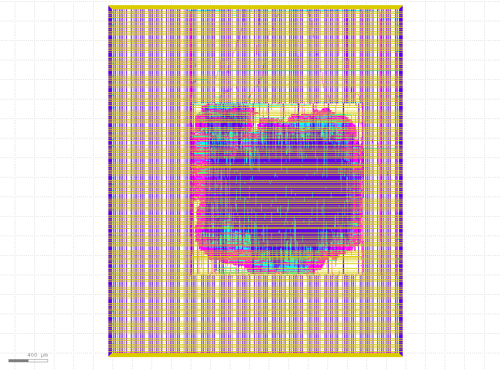
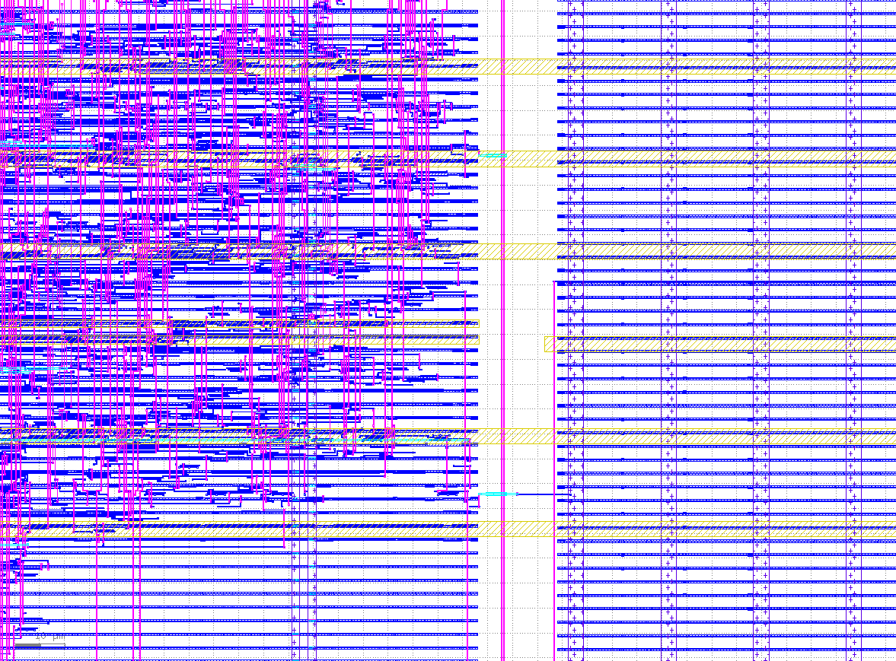
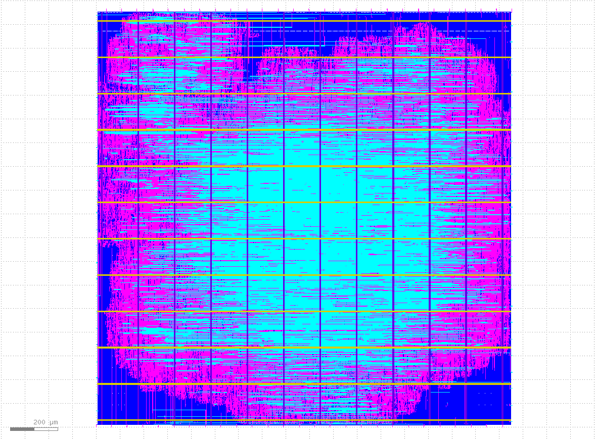
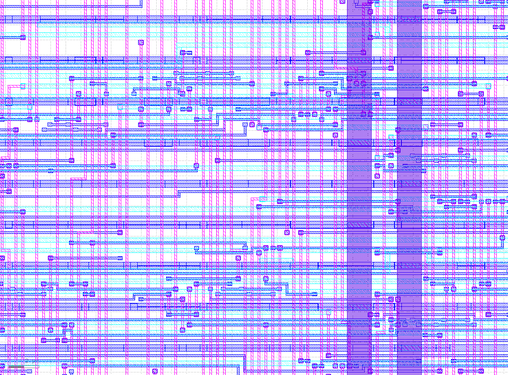
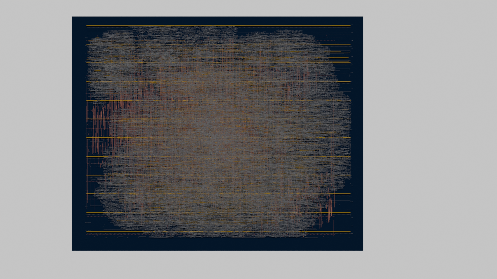

# 🚀 Murax RISC-V SoC: Sky130 Tapeout


-orange)


<p align="center">
  
  <br>
  <i>3D path-traced visual of the Murax RISC-V routing topology (Metal 3 and Metal 4 layers).</i>
</p>

## Overview
This repository contains the full physical design and RTL-to-GDSII pipeline for a custom 32-bit RISC-V microcontroller. The core architecture is based on the **Murax (VexRiscv)** CPU, integrated into the **Efabless Caravel** user project wrapper and targeted for the **SkyWater 130nm** open-source foundry node.

---

## 🛠️ Physical Design & Floorplanning

To bypass heavy core routing congestion that typically exhausts standard flat flows, this project successfully implements a **Hierarchical Physical Design Flow**. 

The $17,000+$ gate Murax CPU core was isolated, floorplanned, and hardened independently as a dense physical macro block before being instantiated as a hard macro into the top-level user project wrapper canvas.

### The Macro Evolution & Congestion Resolution Strategy
Below is the physical timeline of mitigating congestion hotspots across the structural layout:

<table border="0">
  <tr>
    <td width="50%">
      <p align="center">
        
        <br>
        <i><b>1. Macro Floorplan Initialization:</b> Initial placement of the Murax core cell arrays.</i>
      </p>
    </td>
    <td width="50%">
      <p align="center">
        
        <br>
        <i><b>2. Macro Congestion Profile:</b> Pin density analysis inside the hardened block.</i>
      </p>
    </td>
  </tr>
  <tr>
    <td width="50%">
      <p align="center">
        
        <br>
        <i><b>3. Top-Level Integration:</b> Macro drop-in placement with the global Power Delivery Network (PDN).</i>
      </p>
    </td>
    <td width="50%">
      <p align="center">
        
        <br>
        <i><b>4. Final Global Congestion Map:</b> Completely routed routing tracks showing zero unresolvable hotspots.</i>
      </p>
    </td>
  </tr>
</table>

### Key Implementation Metrics:
* **Total Die Footprint:** $10.28\text{ mm}^2$ ($3.19\text{ mm} \times 3.22\text{ mm}$)
* **Core Core Area:** $10.17\text{ mm}^2$
* **Target Signoff Frequency:** $40.0\text{ MHz}$ (Operating at a defined $25\text{ ns}$ clock constraint)
* **Routing Congestion Factor:** Global adjustment set at $0.3$ with a target placement density of $0.15$

---

## 🔬 Manufacturing Signoff & GDSII Quality

The final aggregated GDSII layout stream passed all structural and manufacturing verification suites prior to tapeout submission.

<table border="0">
  <tr>
    <td width="50%">
      <p align="center">
        
        <br>
        <i><b>KLayout Wrapper Boundary:</b> Power stripes interface grid at the wrapper edge.</i>
      </p>
    </td>
    <td width="50%">
      <p align="center">
        
        <br>
        <i><b>KLayout Core Cell Zoom:</b> High-density signal tracks routed to standard cells.</i>
      </p>
    </td>
  </tr>
  <tr>
    <td width="50%">
      <p align="center">
        
        <br>
        <i><b>GDSII Core Layout View:</b> Global structural mask view of the inner Murax macro.</i>
      </p>
    </td>
    <td width="50%">
      <p align="center">
        
        <br>
        <i><b>GDSII Logic Boundary Close-up:</b> Individual routing channels at maximum physical zoom depth.</i>
      </p>
    </td>
  </tr>
</table>

### 📊 Definitive Signoff Metrics (Extracted from `metrics.csv`)

| Verification Metric | Tool / Suite | Status / Count | Technical Context |
| :--- | :--- | :--- | :--- |
| **Design Rule Check (DRC)** | Magic VLSI | `0 Violations` | Clean physical geometry signoff |
| **Layout vs. Schematic (LVS)** | Netgen | `0 Mismatches` | Netlist matches pre-synthesis structural Verilog |
| **Detailed Route Violations** | TritonRoute | `0 Violations` | Clean wire/vias topology across all channels |
| **Antenna Violations** | OpenROAD | `1 Pin / 1 Net` | Fully bounded with automated diode insertion |
| **Worst Negative Slack (WNS)** | OpenSTA | `0.00 ns` | Setup timing completely met across corners |
| **Total Interconnect Vias** | OpenROAD | `1,320 Vias` | Total inter-layer physical via connections |
| **Total Routed Wirelength** | OpenROAD | `95,017 μm` | Cumulative signal wire length over metal stacks |
| **Physical Filler Population**| OpenLANE | `704,363 Cells` | Includes $503,222$ Decaps, $99,793$ Taps, and $100,778$ Fills |
| **Peak Tool Engine Memory** | System | `7,450.71 MB` | Maximum RAM consumed during routing signoff |
| **Total Automated Runtime** | OpenLANE | `1h 11m 45s` | End-to-end wrapper synthesis & stream-out |

---

## 🎨 3D Silicon Visualization & Topography

To fully appreciate the microscopic, multi-layered complexity of the routed ASIC before physical fabrication, the raw GDSII geometric data was exported and path-traced using **Blender's Cycles rendering engine**. 

This 3D visualization highlights the physical spatial relationship between the independent standard-cell logic gates and the upper metal layers routing clock and data highways across the chip.

<table border="0">
  <tr>
    <td width="50%">
      <p align="center">
        
        <br>
        <i><b>Planar View:</b> Highlighting the orthogonal interconnect networks and macro margins.</i>
      </p>
    </td>
    <td width="50%">
      <p align="center">
        
        <br>
        <i><b>Sub-Micron Highlight:</b> Reflective copper ($M4$) tracks running parallel over aluminum ($M3$) channels.</i>
      </p>
    </td>
  </tr>
  <tr>
    <td width="50%">
      <p align="center">
        
        <br>
        <i><b>Isometric Overview:</b> Sharp $45^\circ$ oblique view demonstrating standard cell topography.</i>
      </p>
    </td>
    <td width="50%">
      <p align="center">
        
        <br>
        <i><b>Ray-Traced Close-up:</b> Deep trench shadows visible inside individual routing channels.</i>
      </p>
    </td>
  </tr>
</table>

### Rendering Specifications:
* **Engine:** Cycles Path-Tracing (GPU Compute with OptiX hardware acceleration)
* **Materials:** Custom Physically Based Rendering (PBR) shaders (Albedo/Metallic/Roughness configuration mimicking foundry-deposited metals and highly reflective dark silicon substrate)
* **Camera Profile:** Engineering Orthographic projection at an exact $60^\circ$ pitch to preserve geographic alignment

---

## 🚀 How to Reproduce the Build

### Prerequisites
Ensure your local environment has Docker installed and the Sky130 PDK configured via OpenLANE.

```bash
# 1. Clone the repository and initialize dependencies
git clone [https://github.com/YOUR_USERNAME/murax-sky130-tapeout.git](https://github.com/YOUR_USERNAME/murax-sky130-tapeout.git)
cd murax-sky130-tapeout
make setup

# 2. Extract layout files
make uncompress

# 3. Harden the design files through OpenLANE
make user_project_wrapper